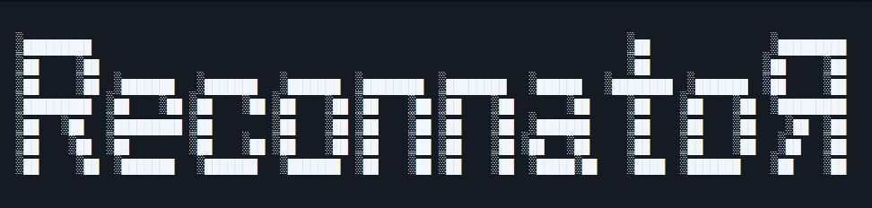

<p align="center">
  
</p>

# Reconnator 2.0: The AI Powered Reconnaisance Tool

**Reconnator** has evolved. What started as a simple, scheduled passive reconnaissance script is now a fully interactive, AI-driven Reconnaisance assistant. Powered by Google Gemini and the Model Context Protocol (MCP), Reconnator operates as a Telegram bot with a highly efficient, somewhat brutal AI persona. 

It orchestrates vulnerability scanning, dynamically routes tools, and seamlessly integrates into modern infrastructure (Docker/Kubernetes) using a container-native attack architecture.

---

#### A Quick Note on the Codebase
   *If you dive into this tool's directory, you might notice something intense. I've added massive, obnoxious `# ==================== #` comment banners to the top of **literally every single file** (Python, Dockerfiles, YAMLs, you name it) so  you (and I) don't get lost in the sauce.*

---

## Key Features (v2.0.0 Architecture)

- 🧠 **AI Brain (Gemini + MCP):** No more rigid menus, just chat with the bot natively. The AI understands your intent, dynamically fetches tools from the MCP Server, and executes complex recon pipelines based on conversational context.
- 🐳 **Ephemeral Docker Workers (DooD):** Attack engines (Nmap, Ffuf, Nuclei, Subfinder) are executed asynchronously inside disposable Docker containers (`--rm`). This prevents dependency hell and keeps the host system squeaky clean.
- 📄 **PDF Reporting:** Automatically compiles raw JSON scan data into a clean, professional PDF report sent directly to your Telegram chat.
- ☸️ **Always-On Kubernetes Daemon:** Transitioned from a legacy CronJob to a 24/7 Kubernetes `Deployment` using Docker-out-of-Docker (DooD) socket mounting for enterprise-grade scalability.
- 🛡️ **Resilient Tooling:** Built-in fallbacks (e.g., if Subfinder fails, automatically queries AlienVault OTX) and automated template baking for tools like Nuclei.

---

## 📚 Documentation

The complete operational and development documentation is available in the
[Reconnator Wiki](https://github.com/amiencoy/Reconnator/wiki).

Start with:

- [Getting Started](https://github.com/amiencoy/Reconnator/wiki/Getting-Started)
- [Architecture Overview](https://github.com/amiencoy/Reconnator/wiki/Architecture-Overview)
- [Deployment](https://github.com/amiencoy/Reconnator/wiki/Deployment)
- [Security and Responsible Use](https://github.com/amiencoy/Reconnator/wiki/Security-and-Responsible-Use)
- [Troubleshooting](https://github.com/amiencoy/Reconnator/wiki/Troubleshooting)

---

## Quick Start

Ensure you have Python 3.11+ installed and the **Docker Engine** running on your host (Reconnator needs access to the Docker daemon to spawn its tools' containers).

### Option 1: Running Locally (Docker-out-of-Docker)

```bash
# Clone the repository
git clone [https://github.com/yourusername/reconnator.git](https://github.com/yourusername/reconnator.git)
cd reconnator

# Setup Environment Variables (Rename the example file)
cp .env.example .env

# Edit .env and add your TELEGRAM_BOT_TOKEN and GEMINI_API_KEY
nano .env

# Build the main Reconnator bot image
docker build -t reconnator:v2 .

# Run the Bot 24/7 (CRITICAL: Mount the docker.sock!)
docker run -d \
  --name reconnator-bot \
  -v /var/run/docker.sock:/var/run/docker.sock \
  --env-file .env \
  reconnator:v2

```

*Once running, open your Telegram bot and simply say: "scan on example.com with nmap, ffuf and nuclei"*

### Option 2: Kubernetes & Helm

Deploy Reconnator in your Kubernetes cluster (e.g., K3s, Minikube, EKS). *Note: Ensure your node's runtime supports Docker sockets.*

```bash
# Navigate to the Helm directory
cd deploy/helm

# Install the chart and inject secrets dynamically
helm install recon-bot . \
  --set telegram.botToken="YOUR_TELEGRAM_TOKEN" \
  --set ai.geminiApiKey="YOUR_GEMINI_API_KEY"

```

---

## 📂 Project Structure

```text
.
├── .github/workflows/    # CI/CD pipelines (Auto GHCR publishing)
├── deploy/helm/          # Kubernetes Helm Chart (Deployment + DooD)
├── src/                  # Core Application
│   ├── modules/          # Ephemeral Engines (nmap, ffuf, nuclei, subfinder, otx, report)
│   ├── agent_core.py     # The AI Brain: Gemini routing & persona
│   ├── mcp_server.py     # The Arsenal: MCP tool registration & schema mapping
│   └── bot.py            # The Mouth & Ears: Telegram ChatOps entrypoint
├── Dockerfile            # Main Alpine-based bot container
├── Dockerfile.ffuf       # Custom multi-stage build for Ffuf + SecLists
├── Dockerfile.nmap       # Minimal Nmap + NSE container
├── Dockerfile.nuclei     # Nuclei container with pre-baked vulnerability templates
├── .env.example          # Environment variable blueprint
└── requirements.txt      # Python dependencies (aiogram, fastmcp, httpx)

```

---

## 🗺️ Roadmap

* [x] Integrate Nmap for deep port & service mapping.
* [x] Integrate Ffuf with baked-in SecLists for directory fuzzing.
* [x] **Layer 3 AI Analysis:** Implement Gemini and MCP to orchestrate the pipeline natively.
* [x] Automated report generation (PDF output).
* [ ] Implement multi-target parallel scanning capabilities.
* [ ] Add continuous monitoring diffs (alerting only on *new* vulnerabilities).

---

## 🤝 Contributing

Contributions, issues, and feature requests are welcome. Before participating,
read the [Contributing Guidelines](CONTRIBUTING.md) and
[Code of Conduct](CODE_OF_CONDUCT.md).

Do not report vulnerabilities through public issues. Follow the
[Security Policy](SECURITY.md) for private disclosure.

## 💖 Support Reconnator

Reconnator is developed and maintained as an open-source project. Sponsorships help support ongoing maintenance, security-tool integrations, testing, documentation, and future releases.

[](https://github.com/sponsors/amiencoy)

Sponsorship supports the project's open-source development and does not include guaranteed support, service-level agreements, custom integrations, or consulting. Commercial deployment and engineering services are handled separately through Draxis Digital.

## 📄 License

Reconnator is dual-licensed under either the [MIT License](LICENSE-MIT) or the [Apache License 2.0](LICENSE-APACHE), at your option. See [LICENSE](LICENSE) for the dual-license declaration.

SPDX license expression: `MIT OR Apache-2.0`.

---


<p align="center">
  <i><small>Built with code and coffee by amiencoy</small></i>
</p>
